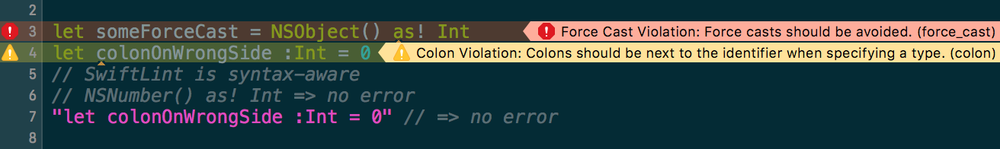
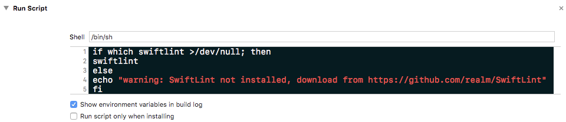
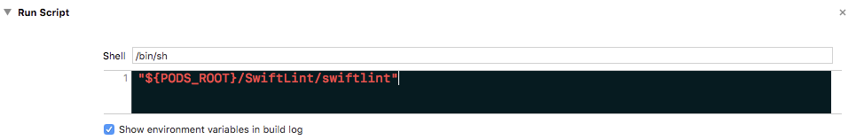
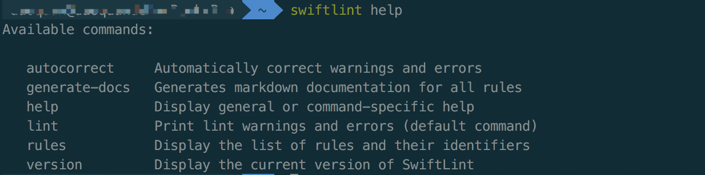
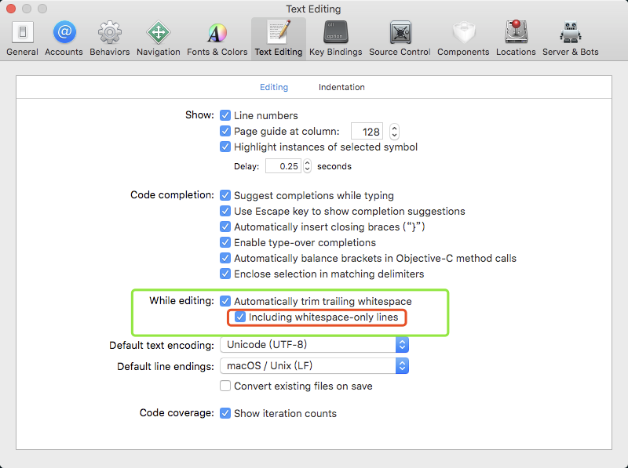

# SwiftLint的使用


---

## 1.介绍

SwiftLint是对Swift语言进行代码规范强制检查的工具，针对规范的违反程度显示warning或error。SwiftLint工作在本地，所以需要安装对应的软件。


## 2.安装

### 2.1 使用[Homebrew](http://brew.sh/)

使用HomeBrew安装时，SwiftLint会被安装到系统环境中，多个工程可以共享。

```
brew install swiftlint
```

安装完成后，需要在Xcode的Build Phases中添加`Run Script`:

```
if which swiftlint >/dev/null; then
  swiftlint
else
  echo "warning: SwiftLint not installed, download from https://github.com/realm/SwiftLint"
fi
```



### 2.2 使用 [CocoaPods](https://cocoapods.org)

> 通过CocoaPods安装SwiftLint，则SwiftLint只针对当前工程生效。

将如下代码添加到你的 Podfile ：

```ruby
pod 'SwiftLint'
```

执行`pod install`安装SwiftLint到`Pods/`文件夹下，可以通过`${PODS_ROOT}/SwiftLint/swiftlint`调用SwiftLint。

故在Xcode的Build Phases中添加如下`Run Script`：

```
"${PODS_ROOT}/SwiftLint/swiftlint"
```




## 3. 使用SwiftLint

直接编译Xcode工程会通过Script自动调用SwiftLint，初次使用，可能会出现很多warning和error。

### 3.1 使用SwiftLint自动修复部分warning或error

SwiftLint自带了`autocorrect`命令来自动修复它能够修复的error或warning：



调用`swiftlint autocorrect`，error和warning会减少很多。

### 3.2 配置规则

可以通过本地创建`.swiftlint.yml`文件来配置具体的规则，以下是基于官方文件修改的配置文件：

- disabled_rules: 关闭某些默认开启的规则。
- opt_in_rules: 一些规则是可选的。
- whitelist_rules: 不可以和 disabled_rules 或者 opt_in_rules 并列。类似一个白名单，只有在这个列表中的规则才是开启的。

```yaml
disabled_rules: # 执行时排除掉的规则（加入表示 不启用该规则）
  - colon
  - comma
  - control_statement

opt_in_rules: # 一些规则仅仅是可选的（加入表示 启用该规则）
  - empty_count

included: # 执行 linting 时包含的路径。如果出现这个 `--path` 会被忽略。
  - Source

excluded: # 执行 linting 时忽略的路径。 优先级比 `included` 更高。
  - Carthage
  - Pods
  - Source/ExcludedFolder
  - Source/ExcludedFile.swift

# 可配置的规则可以通过这个配置文件来自定义
# 二进制规则可以设置他们的严格程度
force_cast: warning # 隐式（表示force_cast规则 只会报warning，默认报error ）
force_try:
  severity: warning # 显式
  
# 同时有警告和错误等级的规则，可以只设置它的警告等级
line_length: 128 # 隐式（超过128 报warning，不报error）

# 可以通过一个数组同时进行隐式设置
type_body_length:
  - 300 # warning
  - 400 # error

# 或者也可以同时进行显式设置
file_length:
  warning: 500
  error: 1200

# 命名规则可以设置最小长度和最大程度的警告/错误
# 此外它们也可以设置排除在外的名字
type_name: # 修改具体的小规则
  min_length: 4 # 只是警告
  max_length: # 警告和错误
    warning: 40
    error: 50
  excluded: iPhone # 排除某个名字

identifier_name:
  min_length: # 只有最小长度
    error: 4 # 只有错误
  allowed_symbols: 
    - _ # 除了字母和数字，还允许下划线
  validates_start_with_lowercase: false # 忽略变量首字母小写
  excluded: # 排除某些名字
    - id
    - URL
    - GlobalAPIKey
reporter: "xcode" # 报告类型 (xcode, json, csv, checkstyle, junit, html, emoji)
```

具体的`规则名`和`规则内容`见：[官方Rules.md](https://github.com/realm/SwiftLint/blob/master/Rules.md)

> `.swiftlint.yml`文件可以在文件夹中嵌套使用，子文件下的`.swiftlint.yml`中的规则会优先生效。

### 3.3 代码文件内的规则控制

除了使用配置文件，在代码中还可以通过注释来禁用/启用`规则`。

- 禁用局部

```swift
// swiftlint:disable colon
let noWarning :String = "" // No warning about colons immediately after variable names!
// swiftlint:enable colon
let hasWarning :String = "" // Warning generated about colons immediately after variable names
```

- 整个swift文件禁用规则

直接将禁用规则写在首行注释上：

```
//
//  URLRouter.swift
//  zhilian
//
//  Created by deerdev on 2017/11/22.
//  Copyright © 2017年 FX. All rights reserved.
//  swiftlint:disable identifier_name
```

### 3.4 自定义规则

参考官方[定义自定义规则](https://github.com/realm/SwiftLint/blob/master/README_CN.md#%E5%AE%9A%E4%B9%89%E8%87%AA%E5%AE%9A%E4%B9%89%E8%A7%84%E5%88%99)

## 4.附录

### 4.1 trailing_whitespace规则

初次使用SwiftLint会出现很多trailing_whitespace规则的warning，建议修改Xcode配置如下：



### 4.2 使用marker自动生成配置文件

简书博主[Maru](https://www.jianshu.com/p/40aa8695503f)创建了个[Maker](https://github.com/Maru-zhang/Maker)工具自动生成`.swiftlint.yml`。

参考：

【1】[https://www.jianshu.com/p/40aa8695503f](https://www.jianshu.com/p/40aa8695503f)
【2】[https://github.com/realm/SwiftLint/blob/master/README_CN.md](https://github.com/realm/SwiftLint/blob/master/README_CN.md)


  [1]: http://static.zybuluo.com/Sweetfish/3tx2k3x8bkyh44undh2tobl8/image.png
  [2]: http://static.zybuluo.com/Sweetfish/h316qy5tkmkcuzi8ukem0oeq/image.png
  [3]: http://static.zybuluo.com/Sweetfish/acg2v7kprq05z2086xsuak2q/image.png
  [4]: http://static.zybuluo.com/Sweetfish/5gyivhlmp0p0jx7ec9iyq069/image.png
  [5]: http://static.zybuluo.com/Sweetfish/f111q1f551ucxy06snt6yah3/image.png

