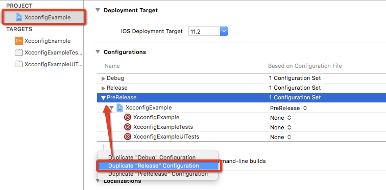
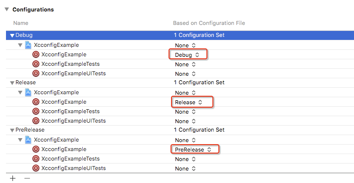

（[The Unofficial Guide to xcconfig files](https://pewpewthespells.com/blog/xcconfig_guide.html)翻译可见[xcconfigGuide.md](./xcconfigGuide.md)）


## 1. 给App添加多个编译环境

在实际App的开发过程中，我们需要依据不同的环境给App打不同包，这些场景可能有开发环境、提交App Store之前的正式环境测试版、提交到App Store的正式版。不同的环境可能会对应不用的App名称和图标，方便区分。

针对不同的环境，我们要配置不同的build setting，主要的配置方法由以下几种：

- 手动配置 或者 通过注释不同环境的代码来区分
- 使用多个Target（[使用 Xcode 的 Target 区分开发和生产环境](http://swift.gg/2016/04/22/using-xcode-targets/)）
- 使用xcconfig

**方法一的缺点**：人工操作频繁，容易出错；
**方法二的缺点**：Target分离了build setting的设置，所以修改公共的build setting时，每个tagart都要修改，重复性工作多；添加文件时也需要勾选多个Target；

而使用`xcconfig`文件可以完美的避免以上问题，只需要根据不同环境创建xcconfig文件，然后再写入对应环境的配置，“一次修改，终生可用”，本文主要介绍该方法，其他方法可通过谷歌了解。

## 2. 使用xcconfig给App配置多个环境

假设App有三个环境：

- debug: 开发环境
- prerelease: 提交App Store之前的正式环境测试版
- release: 提交到App Store的正式版

## 2.1 创建xcconfig文件

- 在Xcode中新建文件，选择Other->Configuration Setting File，分别创建Debug.xcconfig、Release.xcconfig、Release.xcconfig三个文件


## 2.2 给Project的configuration配置xcconfig文件

- 点击工程配置文件Info -> configurations，复制Release的配置，创建一个新的configuration，命名为PreRelease



- 给不同的configuration中的target选择对应的xcconfig文件




- 此时scheme里面就会出现三个Build Configuration，不同configuration会使用对应的xcconfig文件


## 2.3 在xcconfig中创建变量

> GitHub上也有xcconfig文件模板：[xcconfigs](https://github.com/jspahrsummers/xcconfigs)

在build setting中选择需要修改的变量，直接`Command+C`复制该条配置，然后在xcconfig中直接`Command+V`即可粘贴对应设置的键值（Xcode真是非常“完美”），然后修改即可。

例如，复制App的名字，然后在xcconfig中粘贴：


在不同xcconfig配置文件中修改对应的值，即可让App在不同环境下显示不同的名字。

**注意：** 因为Target中的build setting设置[优先级最高](https://pewpewthespells.com/blog/xcconfig_guide.html#BuildSettingInheritance)，所以Target中的build setting的值会覆盖xcconfig中的值，需要回到build setting中，将`Xc`的值删除，让xcconfig中值生效。


### 2.3.1 通过自定义的变量修改

虽然直接copy系统变量然后修改比较方便，但是最好还是通过自定义变量的方式修改，然后将自定义变量的值赋给build setting对应的设置项。

- 创建自定义变量（下面的代码定义了App的名字和icon）

```
/// Debug.xcconfig
// name
XC_PRODUCT_NAME = Xc(test)
// icon
XC_ASSETCATALOG_COMPILER_APPICON_NAME = AppIcon-Dev

/// -----------------------------------------------

/// PreRelease.xcconfig
// name
XC_PRODUCT_NAME = Xc(pre)
// icon
XC_ASSETCATALOG_COMPILER_APPICON_NAME = AppIcon-Pre

/// -----------------------------------------------

/// Release.xcconfig
// name
XC_PRODUCT_NAME = Xc
// icon
XC_ASSETCATALOG_COMPILER_APPICON_NAME = AppIcon
```

- 在build setting中赋值，这样即可将`自定义变量`的值赋给对应的设置


- 同时，自定义变量也会在build setting的最下面显示出来


### 2.3.2 配置Bundle Id让多个环境的App共存

通过2.3.1可知，我们也可以设置Bundle Id的值，让不同环境的App都可以安装在手机上，方便测试，设置如下：

```
/// Debug.xcconfig
// bundle id
XC_PRODUCT_BUNDLE_IDENTIFIER = com.deerdev.XcconfigExample.Dev

/// -----------------------------------------------

/// PreRelease.xcconfig
// bundle id
XC_PRODUCT_BUNDLE_IDENTIFIER = com.deerdev.XcconfigExample.Pre

/// -----------------------------------------------

/// Release.xcconfig
// bundle id
XC_PRODUCT_BUNDLE_IDENTIFIER = com.deerdev.XcconfigExample
```


实际安装效果：


### 2.3.3 设置可代码访问的环境变量

大部分App还需要根据不同的环境来修改一些URL请求的地址，如debug环境需要使用测试服务器的地址，而release和prerelease环境需要使用正式服务器的地址。

- **一种方式是在xcconfig中直接添加自定义变量来存储服务器的URL，然后通过Info.plist读取。**

> 以下内容参考：[Using Xcode Configuration (.xcconfig) to Manage Different Build Settings](https://www.appcoda.com/xcconfig-guide/)

```
/// Debug.xcconfig
// enviroment
BACKEND_URL = http:\/\/www.baidu.com/

/// -----------------------------------------------

/// PreRelease.xcconfig
// enviroment
BACKEND_URL = http:\/\/www.google.com/

/// -----------------------------------------------

/// Release.xcconfig
// enviroment
BACKEND_URL = http:\/\/www.google.com/
```


然后在代码中读取该配置：

```
func infoForKey(_ key: String) -> String? {
        return (Bundle.main.infoDictionary?[key] as? String)?
            .replacingOccurrences(of: "\\", with: "")
 }
```

> OC还可以像宏定义的方式添加：[Xcode使用xcconfig文件配置环境](http://liumh.com/2016/05/22/use-xcconfig-config-specific-variable/)

- **另一种方式是添加预编译标志位，然后在代码中根据标志位定义不同环境的变量（推荐）**

```
/// Debug.xcconfig
// enviroment
XC_CONFIG_CONDITION = DEBUG
XC_CONFIG_FLAG = -DDEV

/// -----------------------------------------------

/// PreRelease.xcconfig
// enviroment
XC_CONFIG_CONDITION = PRERELEASE
XC_CONFIG_FLAG = -DPRE

/// -----------------------------------------------

/// Release.xcconfig
// enviroment
XC_CONFIG_CONDITION = RELEASE
XC_CONFIG_FLAG =
```


在Swift中，可以通过修改build setting的`Other Swift Flags`添加“宏定义”（需要加"`-D`"标志），在文章[Xcode中Active Compilation Conditions和Preprocessor Macros的区别](https://www.crifan.com/xcode_active_compilation_conditions_vs_preprocessor_macros/)中表明Xcode8以后添加了新的build setting设置`Active Compilation Conditions`，也可以为swift添加“宏定义”。

通过代码测试，两种设置方式都可以正确读取自定义的变量：

```swift
/// Active Compilation Conditions
#if DEBUG
    print("debug")
#elseif PRERELEASE
    print("prerelease")
#else
    print("release")
#endif

/// Other Swift Flags
#if DEV
    print("DEV")
#elseif PRE
    print("PRE")
#endif
```


> 在OC中添加和swift中添加不同，对于OBJC，用：`Preprocessor Macros`
对于SWIFT，用：`Active Compilation Conditions`/`Other Swift Flags`，OC设置可参考：[手把手教你给一个iOS app配置多个环境变量](https://www.jianshu.com/p/83b6e781eb51)

## 3. 创建多个Scheme对应多个环境的build

因为不同的环境我们要切换不同的Build Configuration，有“一丢丢”不方便。可以通过创建多个Scheme来解决该问题，每个Scheme的Build Configuration对应相应的环境。


|Scheme| Build Configuration|
| :-- | :-- |
| XcconfigExampleDebug | Debug |
| XcconfigExamplePre | PreRelease |
| XcconfigExample | Release |

此外，在Manage Schemes中，我们需要`Shared`新建的Scheme，这样其他人才可以通过git获取到我们自定义的Scheme：


## 4.CocoaPods的适配

### 4.1 导入出现的问题

导入CocoaPods后，因为CocoaPods也需要使用xcconfig文件，所以Target会被CocoaPods赋值为CocoaPods自己的xcconfig文件：


同时，`pod install`时，可能出现以下错误：


这是我们修改`Other Swift Flags`造成的。


### 4.2 修改配置

- 首先，让我们自定义的xcconfig通过`#include`的方式导入CocoaPods的xcconfig文件

```
/// Debug.xcconfig
#inclide "Pods/Target Support Files/Pods-XcconfigExample/Pods-XcconfigExample.debug.xcconfig"

/// -----------------------------------------------

/// PreRelease.xcconfig
#inclide "Pods/Target Support Files/Pods-XcconfigExample/Pods-XcconfigExample.prerelease.xcconfig"

/// -----------------------------------------------

/// Release.xcconfig
#inclide "Pods/Target Support Files/Pods-XcconfigExample/Pods-XcconfigExample.release.xcconfig"
```

- 然后，将Configurations重新指定为我们的自定义文件


- 再次修改`Other Swift Flags`的配置：


通过`$(inherited)`引入CocoaPods的配置；通过`${XC_CONFIG_FLAG}`引入我们自定义的配置；实际配置如下：


## 参考

【1】[Using Xcode Configuration (.xcconfig) to Manage Different Build Settings](https://www.appcoda.com/xcconfig-guide/)
【2】[Guide To Organizing Your iOS Debug, Development, and Release States With .xcconfig Files](https://hackernoon.com/a-cleaner-way-to-organize-your-ios-debug-development-and-release-distributions-6b5eb6a48356)
【3】[用xcconfig文件配置iOS app环境变量](https://www.jianshu.com/p/9b8bc8351223)
【4】[Xcode使用xcconfig文件配置环境](http://liumh.com/2016/05/22/use-xcconfig-config-specific-variable/)
【5】[手把手教你给一个iOS app配置多个环境变量](https://www.jianshu.com/p/83b6e781eb51)
【6】[Xcode中Active Compilation Conditions和Preprocessor Macros的区别](https://www.crifan.com/xcode_active_compilation_conditions_vs_preprocessor_macros/)
【7】[如何管理上百个渠道包?](http://swiftcn.io/topics/33)

