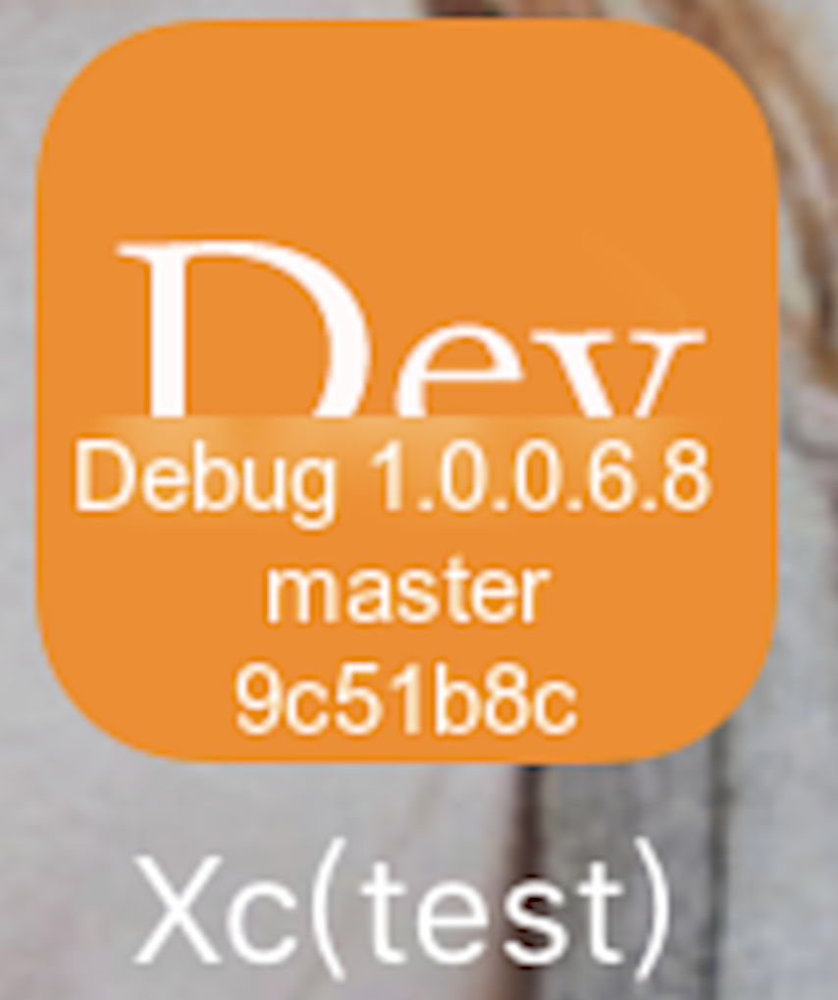

打包时，给Icon添加版本号-git分支-git提交记录：

参考：

【1】[如何在iOS App的图标上显示版本信息](http://www.sybzrw.com/2017/02/21/%E5%A6%82%E4%BD%95%E5%9C%A8iOS-App%E7%9A%84%E5%9B%BE%E6%A0%87%E4%B8%8A%E6%98%BE%E7%A4%BA%E7%89%88%E6%9C%AC%E4%BF%A1%E6%81%AF/)

【2】[iOS Project bootstrap](https://github.com/krzysztofzablocki/Bootstrap)

【3】[iOS——写一个快速定位问题的脚本](https://juejin.im/post/5a30cf72f265da430c11ce8c)

