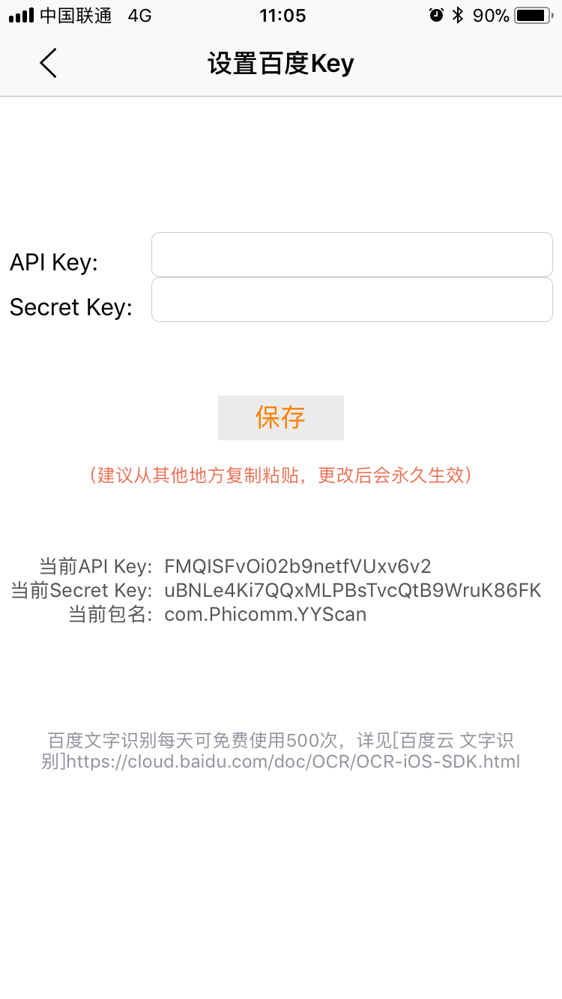
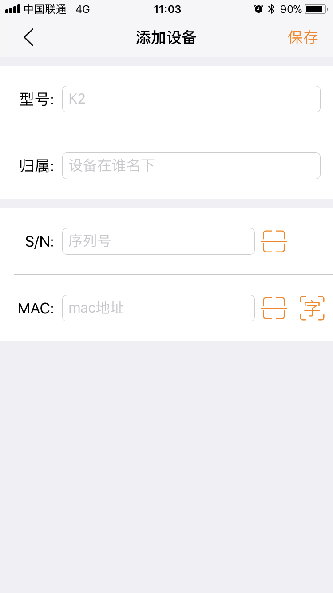
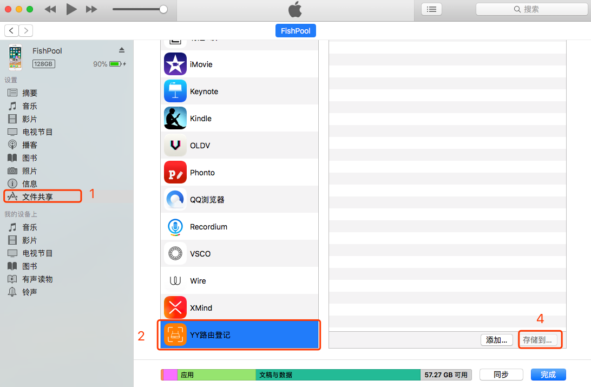
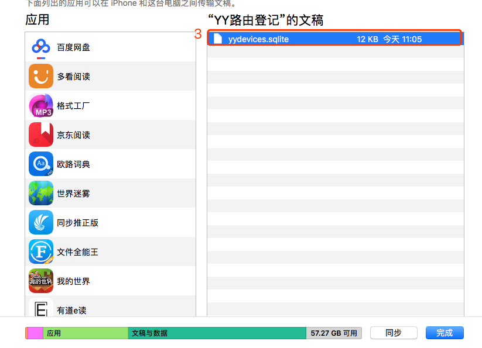
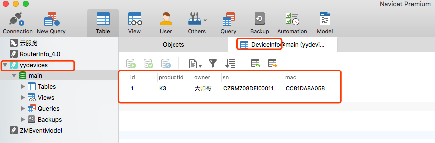
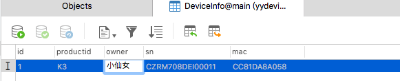
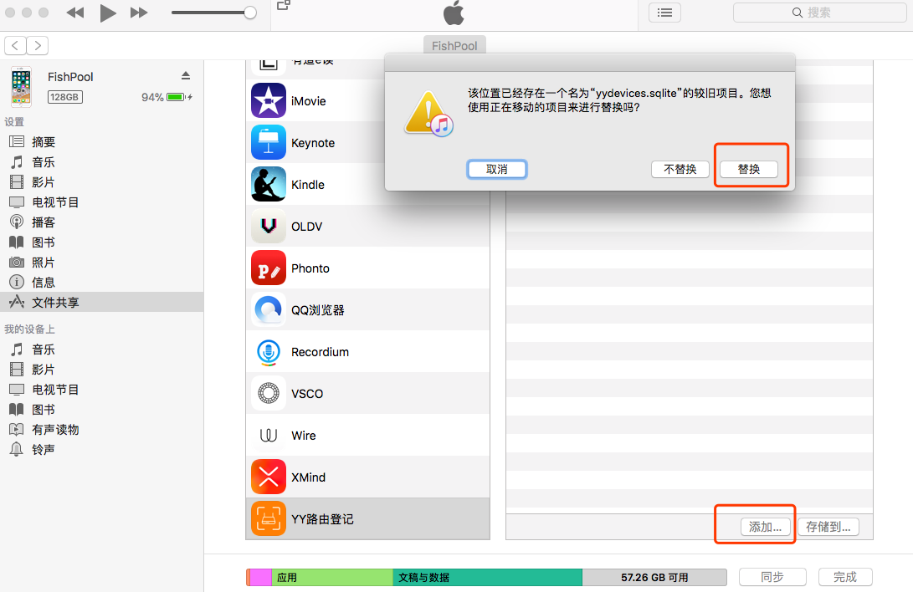

# YY路由登记

## 功能

使用二维码扫描和文字识别，扫描路由器等设备的基本信息并写入数据库，数据库可使用iTunes导出。

## 文字识别

因为路由器设备上没有MAC的条形码，所以无法通过二维码扫描。本工程采用了“百度云 文字识别”，百度云提供了每天500次的免费识别次数，基本够用。

在App中可以修改App的Key，增加使用次数：

key可以通过百度云后台注册新的应用获得：

> [iOS集成百度云SDK方法](https://cloud.baidu.com/doc/OCR/OCR-iOS-SDK.html#SDK.E9.9B.86.E6.88.90.E5.9B.BE.E6.96.87.E6.95.99.E7.A8.8B)

> [后台管理（创建App，获取Key）](https://console.bce.baidu.com/ai/?fromai=1#/ai/ocr/app/list)

## 使用方法

- App基本界面介绍

- 导出数据库文件

- 使用数据库软件（例如 Navicat）打开数据库文件

- 使用Navicat修改数据库文件

- 导入数据库回App（app即可显示修改后的数据）

